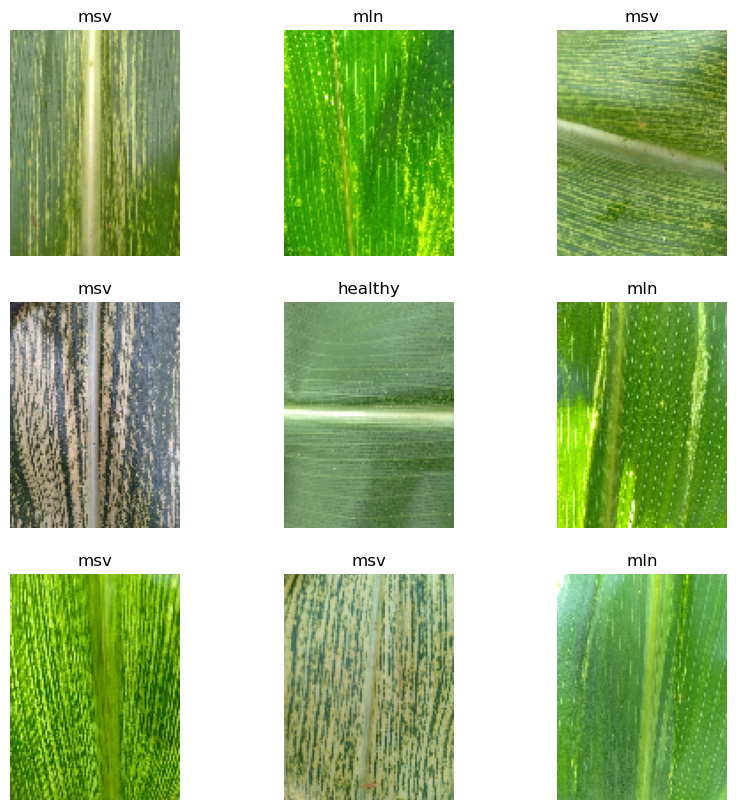

# Maize Disease Identification with TensorFlow

This GitHub repository contains a proof-of-concept model for **identifying two common maize diseases**, *Maize Streak Virus (MSV)* and *Maize Lethal Necrosis (MLN)*, from photographs of maize leaves. The model is built using the **TensorFlow framework** and utilizes deep learning techniques to accurately classify the disease type based on the visual patterns present in the images.

## Problem Statement

Maize, one of the most important cereal crops worldwide, is vulnerable to various diseases that can significantly impact its yield and quality. **MSV and MLN** are two prevalent diseases that affect maize plants, causing substantial losses in agricultural production. Early detection and accurate identification of these diseases are crucial for implementing timely control measures and minimizing crop damage.

## Approach

The proof-of-concept model leverages the power of **deep learning** to automate the identification process. The **TensorFlow framework**, with its extensive ecosystem of tools and libraries, provides a solid foundation for developing and training the disease classification model. By using **convolutional neural networks (CNNs)**, the model can effectively learn and extract relevant features from maize leaf images, enabling accurate disease classification.

## Dataset

The dataset used in this project is the **Nelson Mandela African Institution of Science and Technology Maize dataset**. The dataset was contributed by researchers from the Nelson Mandela African Institution of Science and Technology, namely Neema Mduma, Hudson Laizer, Loyani Loyani, and Sophia Sanga. Additionally, researchers from the Tanzania Agricultural Research Institute (TARI), including Mbwana Macheli, Zablon Msengi, Alice Karama, and Irine Msaki, were also involved in the dataset creation.

The maize images dataset was specifically created to contribute to the study of maize diseases diagnostics, with a focus on **Maize Lethal Necrosis (MLN)** and **Maize Streak Virus (MSV)** diseases. The aim of this dataset is to facilitate image classification and object detection tasks, enabling the development of end-to-end tools to help farmers diagnose diseases and improve maize productivity.

It's important to note that this work was carried out with support from the **Lacuna Fund**, an initiative cofounded by The Rockefeller Foundation, Google.org, and Canada's International Development Research Centre. The dataset identifier for this work is **0328-S-001**. Please refer to the [official DOI link](https://doi.org/10.7910/DVN/GDON8Q) for more details.

We express our gratitude to the researchers and organizations involved in creating and sharing this dataset, as it plays a significant role in advancing the field of maize disease identification and benefiting agricultural practices.

## Repository Structure

The trained model is available in the `models` directory. The `notebooks` directory contains the Jupyter notebooks used for training the model and making predictions on new images. The `reports` directory contains the project report and other supporting files. The `src` directory contains the source code for the model and the dataset. 

To configure usage of the different `notebooks` in this repository fill out the `local_paths.env` file located inside the `notebooks` folder.

The dataset can be downloaded directly from [here](https://dataverse.harvard.edu/dataset.xhtml;jsessionid=69cfa8e992bce072d5a3c4c30d69?persistentId=doi:10.7910/DVN/GDON8Q)

Before attempting to use modelling notebooks, be sure to use the `notebooks/Data Preprocessing.ipynb` notebook to preprocess the dataset.

## Usage

To use the model, follow the instructions provided in the repository's README file. It includes guidelines on:
- Setting up the necessary dependencies
- Preparing the dataset
- Training the model
- Making predictions on new maize leaf images

## Contributions

Contributions to the repository are welcome. If you have ideas for improving the model's performance, enhancing the dataset, or adding new features, please feel free to open an issue or submit a pull request. Together, we can further advance the accuracy and applicability of maize disease identification.

## License

The code and dataset in this repository are released under the **MIT License**. Feel free to use and modify the code for academic, research, or commercial purposes.

We hope that this proof-of-concept model can serve as a starting point for addressing the challenges associated with maize disease identification, leading to more efficient disease management and improved crop yields.